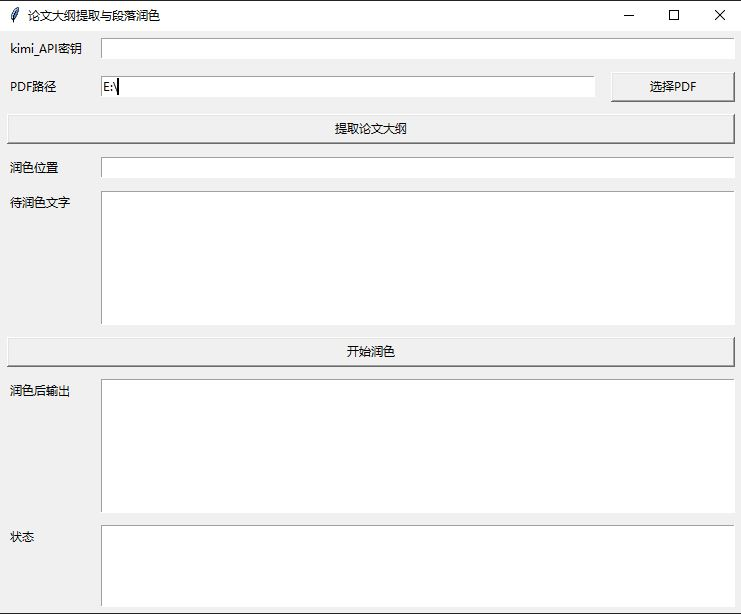

***
# Openwheel
Open-source some readily usable tools. At present, I don't know what to write about.
- ThesisPolish
- ...
***

# Project1 : ThesisPolish  
##  项目介绍(Project Introduction)  
### This tool is designed for the scenario of polishing master's thesis. Based on the Kimi large model, it extracts the main thread of the thesis outline and optimizes the local content, avoiding the logical disconnection and content incoherence problems caused by traditional copy-paste method. The system provides a simple and user-friendly GUI interface, allowing users to input the thesis content, select the polishing model and output the polished results. At the same time, the tool supports integration with personal API, taking into account flexibility, data security and usability reliability.（Version 1 completed）  
### 本工具面向硕士毕业论文润色场景，基于 Kimi 大模型实现论文大纲脉络提取与局部内容优化，避免传统逐段复制粘贴带来的逻辑割裂与内容不连贯问题。系统提供简洁易用的 GUI 界面，支持用户输入论文内容、选择润色模型并输出润色结果。同时，工具支持接入个人 API，兼顾灵活性、数据安全性与使用可靠性。  
***
GUI界面实例：



***
## 代码提交说明(Code Submission Instructions)  
- 代码提交到Openwheel仓库的ThesisPolish目录下
(The code has been submitted to the "ThesisPolish" branch of the Openwheel repository.)  
- 代码提交时,请在提交信息git commit message中按照例子进行编写
(When submitting the code, please follow the example to write the git commit message in the submission information.)
- Here is an example:ThesisPolish:Added what modules;your_name;date
***
## 运行代码(Run Code)  
```
### create a virtual environment
conda create -n thesispolish python=3.10
conda activate thesispolish
pip install --upgrade 'openai>=1.0'


### development stage  
# set model to kimi-k2-0905-preview  
set MOONSHOT_API_KEY=your_api_key
# Generate the overall outline of the thesis.  
python generate_outline.py your_pdf_path

# Based on the outline of the paper, generate localized revision text.    
# 润色完毕的文本在polish.txt文件中(The revised text is stored in the "polish.txt" file.)  
python polish.py --position 需要润色文字所在位置 --test 需要润色文本


### GUI stage  
# start the GUI interface
python GUI.py

```

***
## 工作日志(Work Log)  

### 2026-03-30  
- 完成了kimi api的调用  
- 完成了对pdf信息的提取  
- pdf输出信息在outline.txt文件中  
- 完成了对pdf输出信息的规范化,符合硕士论文要求  
- 增加论文:大纲+局部润色功能,输出在polish.txt文件中    
### further work  
- 整体架构实现了，如何增加交互模块，避免使用命令行(finished)  


### 2026-03-31  
- 完成了GUI界面的实现   
### further work  
- 完善GUI界面的功能,增加交互模块(增加一些kimi模型选项)  
- 更加完善提示词的规范性(太粗略了)  
- 增加更加完善的大纲提取，例如通过对内容的解析更加准确的大提取  
- 学习一下这个tkinter库  
- 增加长文本的输入输出功能  

### 2026-03-31  
- 完成了README.md文件的编写     
### further work  